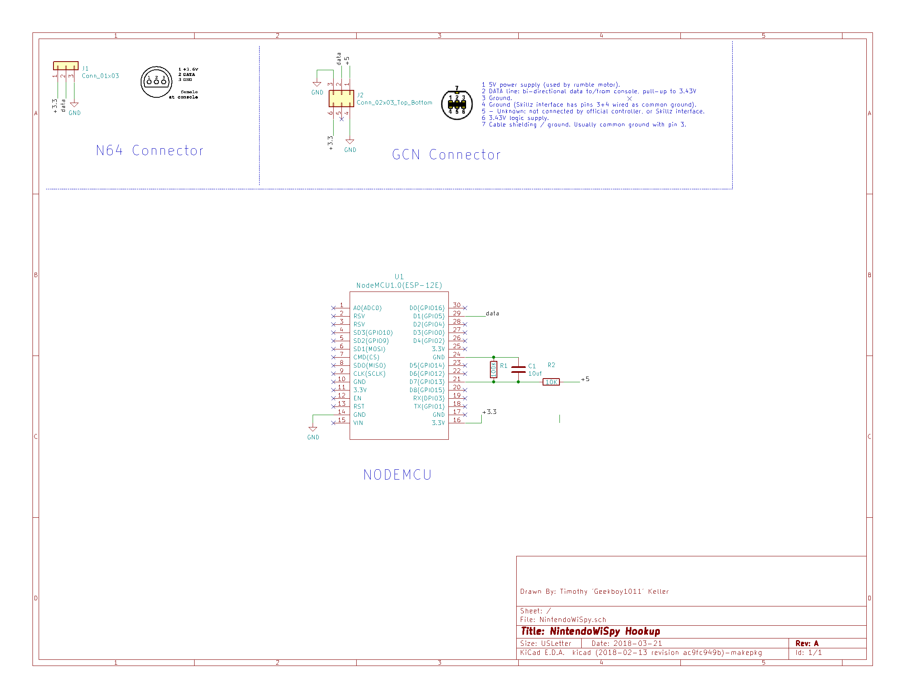

# NintendoSpy Web Edition

A live input-viewer for GameCube/N64 controllers over wifi or usb serial. Used for showing/recording inputs during livestreams/gameplay recording sessions.

# Documentation

## Features
- Runs on Windows/Linux/Mac
- Supports OG NintendoSpy Hardware
- Supports ESP8266 Hardware Over Wifi - Serial support to come with later hardware rev
- Custom Themes in a JSON format
## Requirements
- Python2.7
- PySerial
- [python-websocket-server](https://github.com/Pithikos/python-websocket-server)
## Python Interface
Currently the python2.7 interface is built on top of TKinter. It is a means of starting a web server to host, the input viewer software (javascript + websockets), A Serial -> websocket bridge for older NintendoSpy hardware, and wifi credential management for the ESP2866 hardware.\

##### Serial Baudrate:
- Baud Rate for connected serial device.
##### HTTPSERVER port:
- Port to host the http server on.
##### WebSocket Host:
- Host of the websocket server.
##### Display Socket Port:
- Port that the display applet listens on for controller information.
##### Serial Port:
- Available Serial Devices
##### Theme
- Available Themes.
##### httpserver button:
- Starts a http server to serve the display applet.
##### Serial Forwarder:
- Starts a serial forwarder based off selected comport, Forwards serial packets to display applet.
##### Generate Url:
- Copies Display applet url to your clip board
### Hardware
- NODEMCU v3
- GCN controller extender
- N64 Controllers extender
- 1 100Kohm resistor
- 1 10K Ohm resistor
- 1 10uf Capacitor

Tie matching lines together for GCN/N64 controllers. Take the data line and tie it to Pin D1(GPIO5). The 100k and 10uf capacitor pull down pin D7(GPIO13). The 10k resistor is in series with +5 from the GCN connector.

If you are making a single controller variant,
- GCN: Pull up pin D7(GPIO13)
- N64: Pill down pin D7(GPIO13)